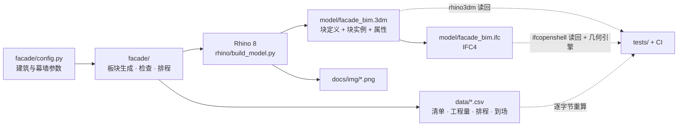

# facade-bim · 单元式幕墙 BIM

[](https://github.com/LUOaini1213/facade-bim/actions/workflows/ci.yml)

**A unitized curtain-wall BIM model built in Rhino 8 with RhinoCommon Python.** 810 panels on a fictional
8-storey office block; five panel types are Rhino block definitions and every panel instance carries 26
attributes. The same model drives design-rule checks, quantity take-off, a 4D install schedule, stillage /
truck / laydown logistics and a site plan, and exports to IFC4 that is schema-valid and byte-reproducible.
CI re-derives every number in this README from the committed `.3dm`, IFC and CSV files — Rhino is not
needed to verify anything here.


## 一眼看懂

- **810** 块单元板块、**5** 种类型（Rhino 块定义）、每块板挂 **26** 项属性（Rhino UserText）
- 模型检查 7 条 + 工地布置检查 5 条，**12/12** 通过；每条检查都有一个故意弄坏的反例证明它会失败
- 4D：**2026-11-02** 开装，**42** 个工作日装完；**140** 个运输架、**47** 车；堆场峰值 **10** 架
- IFC4：**810** 个 IfcPlate，schema 校验 **0** 问题；交给几何引擎算出实体后逐块比对，位置与模型偏差小于 0.01 mm
- 下文每个数字都由 `scripts/check_readme.py` 对着已提交的产物回算，CI 每次提交都跑

建筑是虚构的；非物理常数的参数（型材线密度、工效、每架板数、车辆与堆场限制）集中在
[`facade/config.py`](facade/config.py)，逐项标着【假设】。改那里、重跑，下面的表全部跟着变。

## 一个模型，六份产物



IFC 是从 `.3dm` 里读出来的（块实例的变换给位置，实例属性给数据），不是从参数另算一遍——
所以它证明的是「Rhino 里建的这个模型能交付成开放格式」。

## 模型


| 类型 | 名称 | 数量 | 制作尺寸（mm） | 吊装重（kg） |
|---|---|---|---|---|
| U1 | 首层标准单元 | 88 | 1580 × 4480 | 233.1 |
| U2 | 标准层单元 | 620 | 1580 × 3880 | 201.8 |
| U3 | 机房百叶单元 | 10 | 1580 × 3880 | 129.8 |
| U4 | 首层入口门单元 | 2 | 1580 × 4480 | 258.7 |
| U5 | 女儿墙单元 | 90 | 1580 × 1180 | 63.1 |

外轮廓 48,360 × 24,360 mm，南北立面各 30 列、东西立面各 15 列，模数 1,600 mm、接缝 20 mm，
L1 层高 4,500、L2–L8 层高 3,900、屋面女儿墙 1,200。每块板由竖框、横框、可视中空玻璃、
层间釉面玻璃 + 岩棉 + 铝背板组成（百叶单元把可视区换成铝百叶，门单元多一道门扇）。
Rhino 里 5 种板块是 5 个块定义，810 块板是 810 个块实例，实例名即板块编号；
整个文件 **4,244** 个对象、**26** 个图层。


## 模型检查

规则直接在生成出的几何上量，不信任「按构造应当成立」：接缝是逐对相邻板块量出来的，
冲突是同层板块两两求交。

| 检查 | 结果 | 实测 |
|---|---|---|
| 板块编号唯一 | ✅ | 810 个编号，重复 0 |
| 竖缝宽度 = 20 mm（逐对量） | ✅ | 量了 846 处，偏差 0 处 [] |
| 横缝宽度 = 20 mm（逐对量） | ✅ | 量了 720 处，偏差 0 处 |
| 板块与板块、板块与转角立柱无冲突 | ✅ | 逐对检查 39285 对，冲突 0 |
| 板块位于外轮廓 48360×24360 mm 内 | ✅ | 越界 0 块 |
| 单片玻璃 ≤ 2440×4200 mm | ✅ | 超限 0 片；最接近上限：S-L1-01 vision1 1460×3340，利用率 80% |
| 吊装重 ≤ 小吊机额定 400 kg | ✅ | 超限 0 块；最重 S-L1-15 258.7 kg，利用率 65% |
| 塔吊覆盖整栋楼（半径 50 m） | ✅ | 最远楼角 48.4 m |
| 塔吊覆盖全部架位 | ✅ | 最远架位角 24.1 m |
| 堆场架位 ≥ 排程峰值 | ✅ | 布置图 12 个架位，排程峰值 10 架 |
| 堆场不进坠物禁区（楼外 6 m） | ✅ | 堆场北边 y=-17.6 m，禁区南边 y=-6.0 m |
| 堆场、塔吊、车道都在红线内 | ✅ | 红线 98.4×66.4 m |

`tests/test_model.py` 给每条模型检查配了反例：把一块板挪 5 mm，竖缝或横缝检查必须变红；
让两块板重叠 40 mm，冲突检查必须变红；把塔吊臂长改成 45 m，覆盖检查必须变红。

## 工程量

| 类型 | 数量 | 立面面积 m² | 可视中空玻璃 m² | 层间 m² | 百叶 m² | 门扇玻璃 m² | 型材铝 kg | 背板铝 kg | 压顶铝 kg | 支座 | 板块重 t |
|---|---|---|---|---|---|---|---|---|---|---|---|
| U1 | 88 | 633.60 | 429.12 | 115.63 | 0.00 | 0.00 | 4390.85 | 936.62 | 0.00 | 176 | 20.51 |
| U2 | 620 | 3868.80 | 2480.25 | 814.68 | 0.00 | 0.00 | 27810.72 | 6598.91 | 0.00 | 1240 | 125.12 |
| U3 | 10 | 62.40 | 0.00 | 13.14 | 40.00 | 0.00 | 448.56 | 106.43 | 0.00 | 20 | 1.30 |
| U4 | 2 | 14.40 | 2.51 | 2.63 | 0.00 | 7.01 | 107.97 | 21.29 | 0.00 | 4 | 0.52 |
| U5 | 90 | 172.80 | 0.00 | 134.03 | 0.00 | 0.00 | 1627.92 | 1085.63 | 287.95 | 180 | 5.68 |
| 合计 | 810 | 4752.00 | 2911.88 | 1080.11 | 40.00 | 7.01 | 34386.02 | 8748.87 | 287.95 | 1620 | 153.12 |

立面面积有一道独立的对账：板块模数面积之和 = 外立面周长（不含转角立柱）× 总高，
即 144 m × 33 m = 4,752 m²。

## 4D 安装排程


两个班组、每班每日 8 小时，逐层、每层按南 → 东 → 北 → 西绕楼一圈安装，一块板不跨日拆分。
**2026-11-02** 开装，**2026-12-19** 装完，共 **42** 个工作日。展开立面下条的阶梯状周界线就是这条顺序：
一周装不完一层，周界线落在半层——第 1 周装了 **75** 块、止于 N-L1-30，首层西立面整面落进第 2 周。


## 到场与堆场


沿安装顺序把连续的同类型板块装进运输架（每架 2–10 块，按类型），共 **140** 个架子；
每个架子最迟在首块板安装前 1 个工作日到场，连续 3 个架子拼一车，共 **47** 车，
每日卸车超过 2 车就往前挪（倒排，尽量准时）。首车 **2026-10-31** 到场，堆场峰值 **10** 架（**2026-12-12**），
没有一个架子晚于最迟到场日；拼车让 **41** 个架子比最迟日早到。

堆场按 2 排 × 6 列画了 **12** 个架位——这是布置图的输入，不是按排程反推的，排程要装得进去才算通过。
改两个物流参数重跑：

| 每日卸车上限 | 提前到场（工作日） | 堆场峰值（架） | 比最迟日早到的架子 | 首车到场 | 装得进 12 个架位 |
|---|---|---|---|---|---|
| 1 | 1 | 21 | 124 | 2026-10-26 | 否 |
| 1 | 2 | 24 | 124 | 2026-10-24 | 否 |
| 1 | 3 | 27 | 124 | 2026-10-23 | 否 |
| 2 | 1 | 10 | 41 | 2026-10-31 | 是 |
| 2 | 2 | 14 | 41 | 2026-10-30 | 否 |
| 2 | 3 | 17 | 41 | 2026-10-29 | 否 |
| 3 | 1 | 10 | 41 | 2026-10-31 | 是 |
| 3 | 2 | 14 | 41 | 2026-10-30 | 否 |
| 3 | 3 | 17 | 41 | 2026-10-29 | 否 |

两条读法：大门每天只能卸 1 车时，拼车会把大批架子提前送到，堆场峰值翻倍；
而卸车上限放到 3 车没有任何变化——2 车以上大门就不是瓶颈，瓶颈变成堆场本身：
12 个架位只容得下「提前 1 个工作日到场」，提前 2 天峰值就到 14 架。

## IFC4 交付

`model/facade_bim.ifc` 由 [`scripts/export_ifc.py`](scripts/export_ifc.py) 从 `.3dm` 导出：

- IfcProject → IfcSite → IfcBuilding → **9** 个 IfcBuildingStorey
- 每层每个立面一个 IfcCurtainWall，共 **36** 个，聚合该段的 IfcPlate，共 **810** 个
- **5** 个 IfcPlateType 对应 Rhino 的 5 个块定义：几何放在 IfcRepresentationMap 里，
  每块板用 IfcMappedItem 引用，与 Rhino 的「块定义 / 块实例」一一对应
- **4** 根转角立柱为 IfcMember，**9** 块楼板为 IfcSlab
- 每块板挂 Pset_PlateCommon、自定义的 FacadeBIM_Panel（编号、层、列、安装序号与日期、架号、车号、到场日）
  和 Qto_PlateBaseQuantities（面积、周长、重量）

文件共 **27,099** 个实体，ifcopenshell 的 schema 校验 **0** 个问题。GlobalId 由编号经 uuid5 推出、
文件头时间戳固定、SET 属性按实体序号排序，同一个 `.3dm` 每次导出逐字节相同，CI 直接比对字节。

## 怎么核、怎么复跑

不需要 Rhino（CI 跑的就是这几条）：

```bash
pip install -r requirements.txt
python -m pytest tests                  # 模型检查、排程约束、.3dm ↔ CSV ↔ IFC 对账
python scripts/build_data.py --check    # data/ 与重算结果逐字节一致
python scripts/export_ifc.py --check    # 由 .3dm 重导的 IFC 与已提交文件逐字节一致
python scripts/check_readme.py          # 本文每个数字对着产物回算
```

重建 Rhino 模型与截图需要 Rhino 8（Windows）：

```bash
python scripts/run_rhino.py             # 调起 Rhino 跑 rhino/build_model.py，存 .3dm 与 docs/img/
python scripts/export_ifc.py            # 重导 IFC
python scripts/build_data.py            # 重算 data/
```

## 仓库结构

| 路径 | 内容 |
|---|---|
| `facade/config.py` | 全部参数；几何、物理常数、假设值分开标注 |
| `facade/model.py` | 板块生成：编号、类型、定位、分区、工程量、吊装重 |
| `facade/checks.py` | 7 条模型检查 |
| `facade/schedule.py` | 4D 安装排程、运输架装箱、到场倒排、堆场占用 |
| `facade/site.py` | 施工总平面几何与 5 条布置检查 |
| `facade/pipeline.py` | 把以上算成表，Rhino 脚本、IFC 导出、测试共用 |
| `rhino/build_model.py` | Rhino 8 脚本：块定义、块实例与属性、楼板、转角立柱、分析图层、总平面、出图、存盘 |
| `scripts/run_rhino.py` | 用 `Rhino.exe /runscript` 无人值守地跑上面那个脚本 |
| `scripts/export_ifc.py` | `.3dm` → IFC4 |
| `scripts/build_data.py` | 重算 `data/` |
| `scripts/check_readme.py` | README 数字回算 |
| `model/` | `facade_bim.3dm`、`facade_bim.ifc`、Rhino 构建日志 |
| `data/` | 板块清单、工程量、运输架、车次、逐日安装与堆场、敏感性、检查结果 |
| `tests/` | 模型与检查（含反例）、排程不变量、产物对账 |

`facade/` 只用标准库并保持 Python 3.9 兼容——Rhino 8 内置的 CPython 是 3.9，
Rhino 里的建模脚本和 CI 里的测试 import 的是同一份代码。

## 许可

MIT，见 [LICENSE](LICENSE)。
